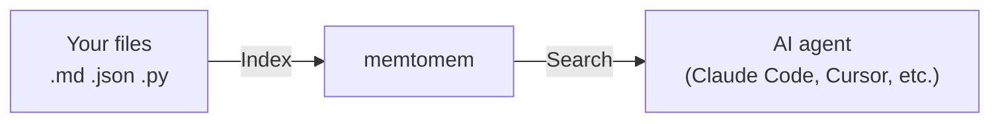

# memtomem

**Official website & docs: [https://memtomem.com](https://memtomem.com)**

[](https://pypi.org/project/memtomem/)
[](https://pypi.org/project/memtomem/)
[](https://github.com/memtomem/memtomem/stargazers)
[](https://python.org)
[](LICENSE)
[](CLA.md)
[](https://data.safetycli.com/packages/pypi/memtomem)

> 🚧 **Alpha** — APIs, defaults, and on-disk config surfaces may still change between `0.1.x` releases. Feedback and issue reports are especially welcome: [Issues](https://github.com/memtomem/memtomem/issues) · [Discussions](https://github.com/memtomem/memtomem/discussions).

**Give your AI agent a long-term memory.**

memtomem turns your markdown notes, documents, and code into a searchable knowledge base that any AI coding agent can use. Write notes as plain `.md` files — memtomem indexes them and makes them searchable by both keywords and meaning.



> **First time here?** Follow the [Getting Started](docs/guides/getting-started.md) guide — you'll have a working setup in under 5 minutes.

---

## Why memtomem?

| Problem | How memtomem solves it |
|---------|------------------------|
| AI forgets everything between sessions | Index your notes once, search them in every session |
| Keyword search misses related content | Hybrid search: exact keywords + meaning-based similarity |
| Notes scattered across tools | One searchable index for markdown, JSON, YAML, Python, JS/TS |
| Vendor lock-in | Your `.md` files are the source of truth. The DB is a rebuildable cache |

---

## Quick Start

### 1. Install

```bash
uv tool install memtomem             # or: pipx install memtomem
mm --version                          # verify install
```

> If `mm --version` shows an older version than the [latest release](https://github.com/memtomem/memtomem/releases), `uv` is likely serving cached PyPI metadata — re-run with `uv tool install memtomem --refresh`, or clear the cache first: `uv cache clean memtomem`.

### 2. Setup

```bash
mm init                               # preset picker, then memory_dir + MCP
```

The interactive picker starts with three presets — **Minimal** (BM25, no downloads), **English (Recommended)** (ONNX `bge-small-en-v1.5` + English reranker + auto-discover providers), **Korean-optimized** (ONNX `bge-m3` + `kiwipiepy` tokenizer + multilingual reranker) — plus an **Advanced** entry that opens the full 10-step wizard. Preset paths only ask about the memory directory and MCP registration; everything else is set from the preset.

For automation / CI:

```bash
mm init -y                            # minimal preset, same as before
mm init --preset korean -y            # Korean-optimized bundle, no prompts
mm init --advanced                    # force the full 10-step wizard
```

See [Embeddings](docs/guides/embeddings.md) for the full model/provider matrix.

### 3. Use

```
"Call the mem_status tool"   →  confirms the server is connected
"Index my notes folder"      →  mem_index(path="~/notes")
"Search for deployment"      →  mem_search(query="deployment checklist")
"Remember this insight"      →  mem_add(content="...", tags=["ops"])
```

### 4. Web UI (optional)

```bash
mm web                # polished dashboard on http://127.0.0.1:8080
mm web --dev          # maintainer surface (adds opt-in pages)
```

`mm web` shows the polished page set by default. Pass `--dev` (or set
`MEMTOMEM_WEB__MODE=dev` in your shell profile) to expose maintainer pages
like Namespaces, Sessions, Working Memory, and Health Report.

<details>
<summary><b>Other install options</b></summary>

**Project-scoped** (per-project isolation):
```bash
uv add memtomem && uv run mm init    # all commands need `uv run` prefix
```

**No install** (uvx on demand):
```bash
claude mcp add memtomem -s user -- uvx --from memtomem memtomem-server
```

See [MCP Client Setup](docs/guides/mcp-clients.md) for Cursor / Windsurf / Claude Desktop / Gemini CLI.

</details>

---

## Key Features

- **Hybrid search** — BM25 keyword + dense vector + RRF fusion in one query
- **Semantic chunking** — heading-aware Markdown, AST-based Python, tree-sitter JS/TS, structure-aware JSON/YAML/TOML
- **Incremental indexing** — chunk-level SHA-256 diff; only changed chunks get re-embedded
- **Namespaces** — organize memories into scoped groups with auto-derivation from folder names
- **Maintenance** — near-duplicate detection, time-based decay, TTL expiration, auto-tagging
- **Web UI** — visual dashboard for search, sources, tags, timeline, dedup, and more (`mm web --dev` for the full maintainer surface)
- **MCP tools** — `mem_do` meta-tool routes all non-core actions in `core` mode for minimal context usage

---

## Ecosystem

| Package | Description |
|---------|-------------|
| [**memtomem**](https://pypi.org/project/memtomem/) | Core — MCP server, CLI, Web UI, hybrid search, storage |
| [**memtomem-stm**](https://github.com/memtomem/memtomem-stm) | STM proxy — proactive memory surfacing via tool interception |

---

## Documentation

| Guide | Description |
|-------|-------------|
| [Getting Started](docs/guides/getting-started.md) | Install, setup wizard, first use |
| [Reference](docs/guides/reference.md) | Complete feature reference for all tools and patterns |
| [Configuration](docs/guides/configuration.md) | All `MEMTOMEM_*` environment variables |
| [Embeddings](docs/guides/embeddings.md) | ONNX, Ollama, and OpenAI embedding providers |
| [LLM Providers](docs/guides/llm-providers.md) | Ollama, OpenAI, Anthropic, and compatible endpoints |
| [MCP Client Setup](docs/guides/mcp-clients.md) | Editor-specific configuration |
| [Uninstalling memtomem](docs/guides/uninstall.md) | Clean removal steps |

---

## Contributing

See [CONTRIBUTING.md](CONTRIBUTING.md) for setup instructions and the contributor guide.

## License

[Apache License 2.0](LICENSE). Contributions are accepted under the terms of the [Contributor License Agreement](CLA.md).
