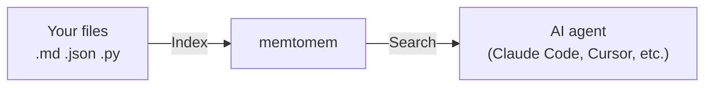

# memtomem

[](https://python.org)
[](LICENSE)

**Give your AI agent a long-term memory.**

memtomem turns your markdown notes, documents, and code into a searchable knowledge base that any AI coding agent can use. Write notes as plain `.md` files — memtomem indexes them and makes them searchable by both keywords and meaning.



> **First time here?** Follow the [Getting Started](docs/guides/getting-started.md) guide — you'll have a working setup in under 5 minutes.

---

## Why memtomem?

| Problem | How memtomem solves it |
|---------|------------------------|
| AI forgets everything between sessions | Index your notes once, search them in every session |
| Keyword search misses related content | Hybrid search: exact keywords + meaning-based similarity |
| Notes scattered across tools | One searchable index for markdown, JSON, YAML, Python, JS/TS |
| Vendor lock-in | Your `.md` files are the source of truth. The DB is a rebuildable cache |

---

## Quick Start (5 minutes)

### 1. Prerequisites

- **Python 3.12+** ([python.org](https://python.org))
- **Ollama** ([ollama.com](https://ollama.com)) — runs the embedding model locally, for free

```bash
ollama pull nomic-embed-text    # ~270MB, one-time
```

> **No GPU or prefer cloud?** Skip Ollama and use OpenAI embeddings — the setup wizard (`mm init`) will guide you. See [Embeddings](docs/guides/embeddings.md).

### 2. Connect to your AI editor

**Claude Code** (recommended):

```bash
claude mcp add memtomem -s user -- uvx --from memtomem memtomem-server
```

**Cursor / Windsurf / Claude Desktop** — add to your MCP config file ([paths here](docs/guides/mcp-clients.md)):

```json
{
  "mcpServers": {
    "memtomem": {
      "command": "uvx",
      "args": ["--from", "memtomem", "memtomem-server"],
      "env": { "MEMTOMEM_INDEXING__MEMORY_DIRS": "~/notes" }
    }
  }
}
```

### 3. Index and search

In your AI editor, ask:

```
"Index my notes folder"  →  mem_index(path="~/notes")
"Search for deployment"  →  mem_search(query="deployment checklist")
"Remember this insight"  →  mem_add(content="...", tags="ops")
```

That's it. Your agent now has long-term memory.

For terminal use, install the CLI separately and run `mm init` for an interactive 7-step setup wizard. See the [Getting Started guide](docs/guides/getting-started.md) for details.

---

## Key Features

- **🔍 Hybrid search** — BM25 keyword + dense vector + RRF fusion. Both exact terms and meaning-based similarity, in one query.
- **📦 Semantic chunking** — heading-aware Markdown, AST-based Python, tree-sitter JS/TS, structure-aware JSON/YAML/TOML
- **♻️ Incremental indexing** — chunk-level SHA-256 diff means only changed chunks get re-embedded
- **🏷️ Namespaces** — organize memories into scoped groups, optional auto-derivation from folder names
- **🧹 Maintenance** — near-duplicate detection, time-based decay, TTL expiration, auto-tagging
- **🌐 Web UI** — visual dashboard for search, sources, tags, sessions, health monitoring
- **🛠️ 72 MCP tools** — full feature surface as MCP tools, with `mem_do` meta-tool routing 64 actions in `core` mode (default) for minimal context usage
- **🧠 Optional STM** — proactive memory surfacing via the [memtomem-stm](https://github.com/memtomem/memtomem-stm) companion package (separate repo)

---

## Documentation

| Guide | Who it's for |
|-------|-------------|
| [Getting Started](docs/guides/getting-started.md) | **Start here** — install, setup wizard, first use |
| [Hands-On Tutorial](docs/guides/hands-on-tutorial.md) | Follow-along with example files |
| [User Guide](docs/guides/user-guide.md) | Complete feature walkthrough — all tools and patterns |
| [Configuration](docs/guides/configuration.md) | All `MEMTOMEM_*` environment variables |
| [Embeddings](docs/guides/embeddings.md) | Ollama and OpenAI providers, model dimensions, switching |
| [MCP Client Setup](docs/guides/mcp-clients.md) | Editor-specific configuration |
| [Agent Memory Guide](docs/guides/agent-memory-guide.md) | Sessions, working memory, procedures, multi-agent |
| [Web UI Guide](docs/guides/web-ui.md) | Visual dashboard |
| [Hooks](docs/guides/hooks.md) | Claude Code hooks for automatic indexing and search |
| [memtomem-stm](https://github.com/memtomem/memtomem-stm) | Optional STM proxy for proactive memory surfacing (separate package) |

---

## Contributing

```bash
git clone https://github.com/memtomem/memtomem.git
cd memtomem
uv venv --python 3.12 && source .venv/bin/activate
uv pip install -e "packages/memtomem[all]"
uv run pytest                            # 891 tests (core only — STM has its own repo)
uv run ruff check packages/memtomem/src  # lint
```

See [CONTRIBUTING.md](CONTRIBUTING.md) for the full contributor guide.

---

## License

[Apache License 2.0](LICENSE)
