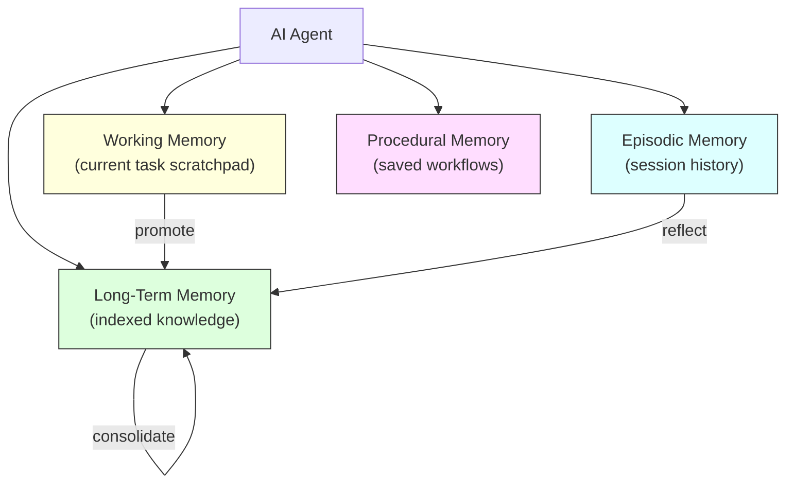
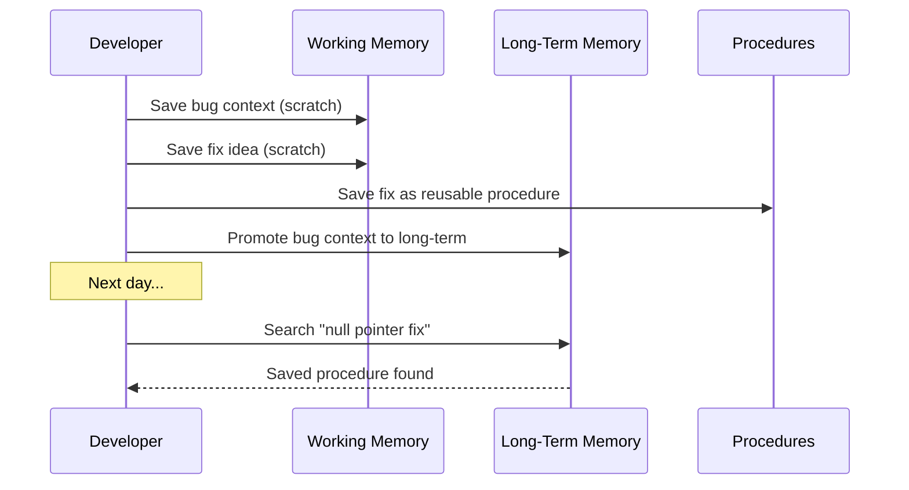
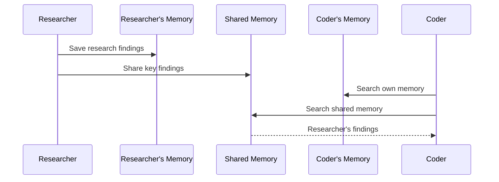
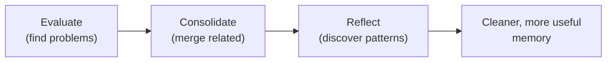

# Agent Memory Harness Guide

**Audience**: Users who want their AI agent to remember across sessions
**Prerequisites**: [Getting Started](getting-started.md) complete, memtomem connected
**Difficulty**: Intermediate — you don't need this for basic search/add. Read this when you want sessions, scratchpads, or reusable workflows.

> **New to memtomem?** Start with [Getting Started](getting-started.md) and [Hands-On Tutorial](hands-on-tutorial.md) first. This guide covers advanced memory patterns.

---

## What are "memory types"?

Think of how your own memory works:

| Memory type | Human analogy | memtomem equivalent |
|-------------|---------------|---------------------|
| **Long-Term** | Notes you've written down | `mem_search`, `mem_add`, `mem_index` — your indexed files |
| **Working** | Sticky notes on your desk during a task | `mem_scratch_set/get` — temporary, deleted after session |
| **Episodic** | "Last Tuesday I debugged the auth bug" | `mem_session_*` — session history with timestamps |
| **Procedural** | "Here's how I deploy to production" | `mem_procedure_save/list` — reusable step-by-step workflows |

**You already have Long-Term Memory** if you've done the Getting Started guide. The other types are optional and useful for more advanced workflows.

---

## Overview

AI agents forget everything between sessions. memtomem gives them memory that persists, organized like how humans remember:



| Capability | Why it matters | Tools |
|------------|---------------|-------|
| **Episodic Memory** | Know what happened in previous sessions | `mem_session_*` |
| **Working Memory** | Hold temporary context during a task without polluting long-term memory | `mem_scratch_*` |
| **Procedural Memory** | Reuse successful workflows instead of re-inventing them | `mem_procedure_*` |
| **Multi-Agent Memory** | Let agents share knowledge without stepping on each other | `mem_agent_*` |
| **Consolidation** | Summarize scattered notes into coherent knowledge | `mem_consolidate*` |
| **Reflection** | Discover patterns and gaps in what the agent knows | `mem_reflect*` |
| **Evaluation** | Monitor memory health (stale data, missing tags, unused memories) | `mem_eval` |

---

## Scenario 1: Developer's Daily Workflow

A developer debugging a bug, saving the fix as a procedure for future reuse.



### Session Start

```
> mem_session_start(agent_id="developer", title="Bug fix: auth timeout")
→ Session started: a1b2c3d4...
  Title: Bug fix: auth timeout
  Agent: developer
  Namespace: default
```

The optional `title` parameter gives the session a human-readable name that appears in `session_list`.

### Working Memory During Debug

```
> mem_scratch_set(key="bug_context", value="UserService.login() throws NPE when email is null")
→ Stored: bug_context [session: a1b2c3d4...]

> mem_scratch_set(key="fix_idea", value="Add null check before email.toLowerCase()")
→ Stored: fix_idea [session: a1b2c3d4...]

> mem_scratch_get()
→ Working memory: 2 entries
    bug_context: UserService.login() throws NPE when email...
    fix_idea: Add null check before email.toLowerCase()...
```

### Save Fix as Procedure

```
> mem_procedure_save(
    name="NPE Fix Pattern",
    steps="1. Check input params for null\n2. Add @NonNull annotation\n3. Write unit test for null case",
    trigger="NPE in service layer",
    tags=["java", "debugging"]
  )
→ Memory added to procedures/npe-fix-pattern.md
  Chunks indexed: 1
```

### Promote Working Memory to Long-Term

```
> mem_scratch_promote(key="bug_context", title="Login NPE Root Cause", tags=["bugfix", "java"])
→ Promoted 'bug_context' to long-term memory.
  Memory added to ...
```

### Session End

```
> mem_session_end(summary="Fixed login NPE, saved fix procedure")
→ Session ended: a1b2c3d4...
  Events: 4 (query:2, add:2)
  Summary: Fixed login NPE, saved fix procedure
  Working memory cleaned: 1 entries
```

### Next Day — Retrieve Procedure

```
> mem_search(query="null pointer exception fix", source_filter="procedures")
→ [1] Procedure: NPE Fix Pattern (score: 0.85)
  Trigger: NPE in service layer
  Steps: 1. Check input params...
```

---

## Scenario 2: Multi-Agent Team Collaboration

A research agent and a coding agent sharing knowledge through namespaced memory.



### Register Agents

```
> mem_agent_register(agent_id="researcher", description="Research and analysis agent")
→ Agent registered: researcher
  Namespace: agent/researcher
  Shared namespace: shared

> mem_agent_register(agent_id="coder", description="Code implementation agent")
→ Agent registered: coder
  Namespace: agent/coder
```

### Researcher Saves Findings

```
> mem_add(
    content="GraphQL federation allows composing multiple subgraphs. Apollo Gateway handles schema stitching.",
    title="GraphQL Federation Research",
    tags=["graphql", "architecture"],
    namespace="agent/researcher"
  )
→ Memory added to agent/researcher scope
```

### Share to Team

```
> mem_agent_share(chunk_id="abc123...", target="shared")
→ Shared to namespace 'shared'.
  Memory added to shared scope
```

### Coder Searches Shared + Own Scope

```
> mem_agent_search(query="GraphQL architecture", agent_id="coder", include_shared=True)
→ [1] GraphQL federation allows composing... (shared)
  [2] Apollo Gateway handles schema... (agent/researcher)
```

---

## Scenario 3: Memory Quality Management

Over time, memories accumulate and become noisy. These tools help keep your knowledge base healthy.



### Health Check

```
> mem_eval()
→ ## Memory Health Report

  ### Index Stats
  - Total chunks: 384
  - Total sources: 114

  ### Access Coverage
  - Never accessed: 371/384 (97%)
  - Accessed at least once: 13/384 (3%)

  ### Tag Coverage
  - Tagged: 15/384 (4%)
  - Untagged: 369/384 (96%)

  ### Namespace Distribution
    default: 380 chunks
    agent/researcher: 2 chunks
    shared: 2 chunks
```

### Find Consolidation Candidates

```
> mem_consolidate(min_group_size=3)
→ Consolidation candidates: 5 groups

  ### Group 0: user-guide.md
    Chunks: 16, ~5800 tokens
    - [abc123] Quick Start Guide...
    - [def456] Configuration section...
    → Use mem_consolidate_apply(group_id=0, summary='...')
```

### Apply Consolidation (Agent Writes Summary)

```
> mem_consolidate_apply(
    group_id=0,
    summary="User guide covers: quick start (ollama + MCP setup), search/add/index workflows, namespace management, Google Drive multi-device setup, and Web UI dashboard."
  )
→ Consolidation applied for group 0.
  Memory added to ...
  Original chunks: 16
  Originals kept: True
```

### Reflect on Patterns

```
> mem_reflect()
→ ## Memory Reflection Report

  ### Frequently Accessed Topics
    10x — deployment steps
    6x — GraphQL architecture

  ### Recurring Themes (by tag)
    procedure: 3 chunks
    architecture: 2 chunks

  ### Knowledge Gaps (frequent queries with no results)
    3x — "kubernetes pod debugging"
    2x — "Redis cluster configuration"
```

### Save Insight

```
> mem_reflect_save(
    insight="Deployment and architecture decisions are the most frequently accessed topics. Knowledge gaps exist in Kubernetes and Redis areas — consider adding documentation.",
    tags=["strategy"]
  )
→ Insight saved.
  Memory added to reflections.md
```

---

## Scenario 4: Search Quality Tuning

Fine-tuning search behavior with per-query weight adjustment.

### Default Search (Equal BM25 + Dense)

```
> mem_search(query="deployment automation", top_k=3)
→ [1] score=0.0328 | CI/CD pipeline configuration...
```

### Keyword-Heavy Search (BM25 Boosted)

When you need exact keyword matches (e.g., error messages, config keys):

```
> mem_search(query="MEMTOMEM_EMBEDDING__DIMENSION", bm25_weight=3.0, dense_weight=0.5)
→ [1] score=0.0984 | Configuration section with exact variable name...
```

### Semantic-Heavy Search (Dense Boosted)

When you need conceptual matches (e.g., "how does X work"):

```
> mem_search(query="how does the search pipeline combine results", bm25_weight=0.5, dense_weight=3.0)
→ [1] score=0.0984 | Reciprocal Rank Fusion merges BM25 and dense...
```

---

## Scenario 5: Structured Templates

Using built-in templates for consistent knowledge capture.

### Architecture Decision Record

```
> mem_add(
    template="adr",
    content='{"title": "Use PostgreSQL", "status": "accepted", "context": "Need ACID for financial data", "decision": "PostgreSQL with pgvector", "consequences": "Team training needed"}'
  )
→ Memory added with structured format:
  ## ADR: Use PostgreSQL
  **Status**: accepted
  **Context**: Need ACID for financial data
  **Decision**: PostgreSQL with pgvector
  **Consequences**: Team training needed
```

### Meeting Notes

```
> mem_add(
    template="meeting",
    content='{"title": "Sprint Planning", "attendees": "Alice, Bob", "agenda": "Q2 roadmap", "decisions": "Prioritize auth module", "action_items": "Bob: JWT by Friday"}'
  )
→ Date auto-filled to today (2026-03-31)
```

### Debug Log (Plain Text)

```
> mem_add(
    template="debug",
    content="Server returned 500 on /api/users after deploying v2.3"
  )
→ Content used as symptom field, other fields marked (fill: ...)
```

### Available Templates

| Template | Fields | Auto-fills |
|----------|--------|------------|
| `adr` | title, status, context, decision, consequences | status → "proposed" |
| `meeting` | title, date, attendees, agenda, decisions, action_items | date → today |
| `debug` | title, symptom, root_cause, fix, prevention | — |
| `decision` | title, options, chosen, rationale | — |
| `procedure` | title, trigger, steps, tags | — |

---

## Scenario 6: URL Fetching and Indexing

Index external web pages as searchable memory.

```
> mem_fetch(url="https://docs.example.com/api/authentication", tags=["reference", "api"])
→ Fetched and indexed: https://docs.example.com/api/authentication
  Saved to: ~/.memtomem/memories/_fetched/docs-example-com-api-authentication.md
  Chunks indexed: 3

> mem_search(query="API authentication bearer token")
→ [1] score=0.85 | docs-example-com-api-authentication.md
  Use **Bearer tokens** for API authentication...
```

HTML is automatically converted to markdown. Script/style/nav/footer elements are removed.

---

## Tool Mode Configuration

Control how many tools are exposed to the AI agent:

```json
"env": { "MEMTOMEM_TOOL_MODE": "standard" }
```

| Mode | Tools | Recommended For |
|------|-------|-----------------|
| `core` (default) | 9 (8 core + `mem_do`) | Simple search + add workflows; `mem_do` routes to all other actions |
| `standard` | ~30 + `mem_do` | Normal use with editing, tags, sessions, procedures |
| `full` | 63 + `mem_do` | Full harness including consolidation, reflection, evaluation |

Web UI and CLI always have full access regardless of tool mode.

---

## Next Steps

- [User Guide](user-guide.md) — Core features walkthrough
- [Use Cases](use-cases.md) — Basic MCP tool workflows
- [Claude Code Integration](integrations/claude-code.md) — Plugin and hooks setup
