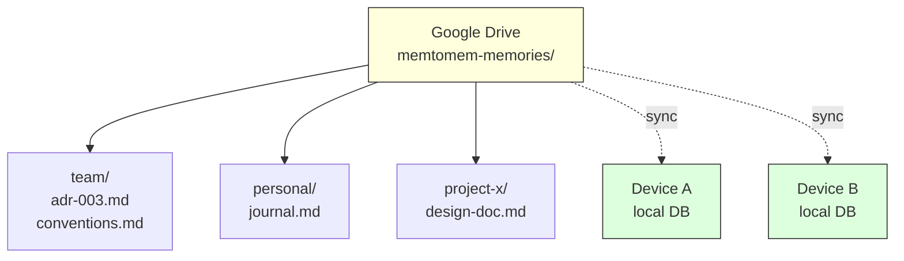

# Google Drive Integration (Multi-Device / Team)

memtomem works across devices and teams by sharing files via any cloud sync client (Google Drive, OneDrive, iCloud Drive, Dropbox, etc.) while keeping the search index local per device.

> **Prerequisite**: install and configure a sync client so that the shared folder appears at a local filesystem path. See [Cloud Sync Client Setup](cloud-sync.md) for per-provider steps (Google Drive for desktop, OneDrive, iCloud Drive) before continuing — examples below use Google Drive but any provider with a verified local path plugs into the same `MEMORY_DIRS` slot.

## Core Principles

| Item | Location | Why |
|------|----------|-----|
| Markdown files | Google Drive (shared) | Single source of truth, synced across devices |
| SQLite DB | Local per device (`~/.memtomem/`) | WAL mode is incompatible with cloud sync — corruption risk |
| Folder structure | Namespace-based subfolders | `auto_ns` maps subfolder names to namespaces |

Each device builds its own search index by indexing the same shared files. The DB stores absolute paths internally, so each device's index is independent.

> **Streaming / Files-On-Demand caveat**: if your sync client has an on-demand mode (Google Drive Stream, OneDrive Files On-Demand ON, iCloud "Optimize Mac Storage"), pin `memtomem-memories` as always-available-offline — the indexer cannot read cloud-only placeholders. Per-provider pinning steps are in [Cloud Sync Client Setup](cloud-sync.md).

## Architecture



Files live on Google Drive (shared). Each device builds its own local search index independently.

> **Folder = Namespace**: With `ENABLE_AUTO_NS=true`, subfolder names become namespaces automatically. Files at the root of `memory_dirs` get the `default` namespace. Create subfolders to organize by team, project, or topic.

## Step 1: Create the shared folder

Set up a namespace-based folder structure on Google Drive:

```
Google Drive/My Drive/
  memtomem-memories/
    team/               ← shared team knowledge → namespace "team"
    personal/           ← individual notes → namespace "personal"
    project-alpha/      ← project docs → namespace "project-alpha"
```

For teams, share the `memtomem-memories` folder with members.

## Step 2: Configure each device

Point `MEMORY_DIRS` to the Google Drive sync path. Keep the DB local.

Add the block below to your editor's MCP config file — the path depends on
the editor. Common locations: `~/.cursor/mcp.json` (Cursor),
`~/.codeium/windsurf/mcp_config.json` (Windsurf),
`~/Library/Application Support/Claude/claude_desktop_config.json`
(Claude Desktop), `~/.gemini/settings.json` (Gemini CLI), or use
`claude mcp add` for Claude Code. See
[MCP Client Configuration](mcp-clients.md) for the full list.

**macOS** (Drive syncs to `~/Library/CloudStorage/GoogleDrive-{email}/My Drive/` or `~/Google Drive/My Drive/`):

```json
{
  "mcpServers": {
    "memtomem": {
      "command": "uvx",
      "args": ["--from", "memtomem", "memtomem-server"],
      "env": {
        "MEMTOMEM_STORAGE__SQLITE_PATH": "~/.memtomem/memtomem.db",
        "MEMTOMEM_INDEXING__MEMORY_DIRS": "[\"~/Google Drive/My Drive/memtomem-memories\"]",
        "MEMTOMEM_NAMESPACE__ENABLE_AUTO_NS": "true"
      }
    }
  }
}
```

**Windows**:

```json
{
  "env": {
    "MEMTOMEM_STORAGE__SQLITE_PATH": "%USERPROFILE%\\.memtomem\\memtomem.db",
    "MEMTOMEM_INDEXING__MEMORY_DIRS": "[\"G:\\\\My Drive\\\\memtomem-memories\"]",
    "MEMTOMEM_NAMESPACE__ENABLE_AUTO_NS": "true"
  }
}
```

## Step 3: Initial indexing

Each device indexes the shared folder to build its local search index:

```
mem_index(path="~/Google Drive/My Drive/memtomem-memories")
→ Indexing complete:
  - Files scanned: 47
  - Total chunks: 312
  - Indexed: 312
  - Skipped (unchanged): 0
  - Deleted (stale): 0
  - Duration: 2340ms
```

## Step 4: Daily workflow

**Adding notes** — Use relative paths in `mem_add`. The path is resolved against `memory_dirs[0]` (the shared Drive folder), so it works identically on every device:

```
mem_add(content="Sprint: migrate to GraphQL", file="team/decisions.md", tags="architecture")
→ writes to ~/Google Drive/My Drive/memtomem-memories/team/decisions.md
→ Google Drive syncs to other devices
```

**Searching** — Instant, uses the local index:

```
mem_search(query="GraphQL decision", namespace="team")
```

**Syncing** — After other devices' files sync, re-index to pick up changes:

```
mem_index(path="~/Google Drive/My Drive/memtomem-memories")
```

> **Note**: Cloud-sync mounts (Google Drive Stream, OneDrive Files-On-Demand
> ON, iCloud Optimize Storage) generally do not emit fs watcher events on
> macOS/Linux, so the watcher will not auto-pick-up sync-delivered changes
> at all — even on initial scan. Pin the folder offline (per
> [Cloud Sync Client Setup](cloud-sync.md)) for native fs events, or run
> `mem_index` manually after each sync to refresh.

## Step 5: Team workflow example

```
Alice (Machine A):
  mem_add(content="Auth: JWT + refresh tokens", file="team/adr-003.md")
  → file syncs to Google Drive

Bob (Machine B, after sync completes):
  mem_index(path="~/Google Drive/My Drive/memtomem-memories")
  mem_search(query="authentication decision")
  → finds Alice's ADR entry in namespace "team"
```

## Limitations

**Absolute paths in DB**: Each device stores full resolved paths (e.g., `/Users/alice/Google Drive/...`). This means:
- `mem_delete(source_file=...)` only works with the local device's paths
- `source_filter` substring matching works across devices if you use folder names (e.g., `source_filter="team/"`)
- Namespace-based filtering (`namespace="team"`) is more reliable than path-based filtering across devices

**Export/Import**: `mem_export` includes absolute paths in the JSON bundle. Importing on another device preserves those paths as metadata, but they may not match the local filesystem. For cross-device sharing, use Google Drive file sync + `mem_index` instead of export/import. Use export/import for same-device backup and restore only.

## Checklist

| Item | Guidance |
|------|----------|
| Files on Google Drive | **Required** — single source of truth |
| DB local per device | **Required** — WAL mode breaks with cloud sync |
| Subfolder = namespace structure | **Recommended** — consistent organization |
| `ENABLE_AUTO_NS=true` | **Recommended** — auto-maps folders to namespaces |
| `mem_index` after sync | **Recommended** — reliable re-indexing |
| Relative paths in `mem_add` | **Recommended** — works identically on all devices |
| Periodic `mem_dedup_scan` | **Recommended** — catch overlapping edits |
| Store `.db` on cloud drive | **Never** — causes corruption |
| `mem_export` for cross-device sharing | **Not recommended** — use file sync instead |

---

## Next Steps

- [Cloud Sync Client Setup](cloud-sync.md) — Install Google Drive for desktop, OneDrive, or iCloud Drive (the prerequisite above)
- [User Guide](user-guide.md) — Complete feature walkthrough
- [Agent Context Management](agent-context.md) — `mm context` for multi-editor setups
- [Configuration](configuration.md) — All `MEMTOMEM_*` environment variables
